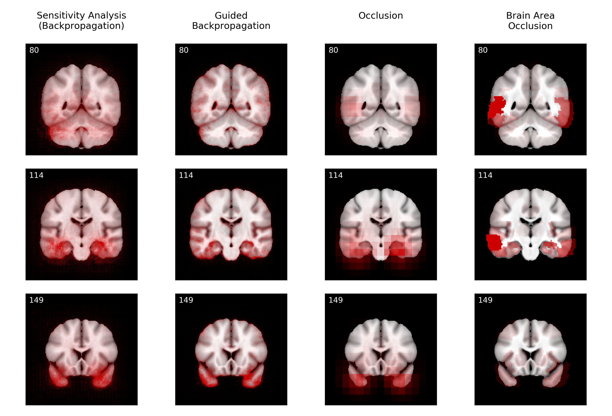

# MRI-based Diagnosis of Alzheimer’s Disease using Convolutional Neural Networks and Visualization Methods

**Ilias Panagiotaras**

This project was part of my internship (2019) at National Center for Scientific Research "[Demokritos](http://www.demokritos.gr/)".

**Abstract:** Visualizing and interpreting convolutional neural networks (CNNs) is an important task to increase trust in automatic medical decision making systems. In this study, we train a 3D CNN to detect Alzheimer’s disease based on structural MRI scans of the brain. Then, we apply four different gradient-based and occlusion-based visualization methods that explain the network’s classification decisions by highlighting relevant areas in the input image. We compare the methods qualitatively and quantitatively. We find that all four methods focus on brain regions known to be involved in Alzheimer’s disease, such as inferior and middle temporal gyrus. While the occlusion-based methods focus more on specific regions, the gradient-based methods pick up distributed relevance patterns. Additionally, we find that the distribution of relevance varies across patients, with some having a stronger focus on the temporal lobe, whereas for others more cortical areas are relevant. In summary, we show that applying different visualization methods is important to understand the decisions of a CNN, a step that is crucial to increase clinical impact and trust in computer-based decision support systems.

## Quickstart

You can use the visualization methods in this repo on your own model (PyTorch; for other frameworks see below) like this:

    from interpretation import sensitivity_analysis
    from utils import plot_slices

    cnn = load_model()
    mri_scan = load_scan()

    heatmap = sensitivity_analysis(cnn, mri_scan, cuda=True)
    plot_slices(mri_scan, overlay=heatmap)
    
`heatmap` is a numpy array containing the relevance heatmap. The methods should work for 2D and 3D images alike. Currently, four methods are implemented and tested: `sensitivity_analysis`, `guided_backprop`, `occlusion`, `area_occlusion`. Please look at `interpretation.py` for further documentation.

## Trained Model

If you don't want to train the model, you can just download the trained model `output/models/softmax-output_state-dict_1.5Τ.pt`. This is the final model that I used to produce all heatmaps in the paper (as a pytorch state dict; see report or code for more details on how the model was trained).

## Code Structure

The codebase uses PyTorch and Jupyter notebooks. The main files are:

- `cnn_training.ipynb` is the notebook to train the model and perform cross validation.
- `cnn_vis.ipynb` contains the code to create relevance heatmaps with different visualization methods. It also includes the code to reproduce all figures and tables from the paper.
- All `*.py` files contain methods that are imported in the notebooks above.

## Data

The MRI scans used for training are from the [Alzheimer Disease Neuroimaging Initiative (ADNI)](http://adni.loni.usc.edu/). The data is free but you need to apply for access on http://adni.loni.usc.edu/. Once you have an account, go [here](http://adni.loni.usc.edu/data-samples/access-data/) and log in. 

### Tables

We included csv tables with metadata for all images we used in this repo (`data/ADNI/ADNI_tables`). These tables were made by combining several data tables from ADNI. There is one table for 1.5 Tesla scans and one for 3 Tesla scans. In the paper, we trained only on the 1.5 Tesla images. 

### Images

To download the corresponding images, log in on the ADNI page, go to "Download" -> "Image Collections" -> "Data Collections". In the box on the left, select "Other shared collections" -> "ADNI" -> "ADNI1:Annual 2 Yr 1.5T" (or the corresponding collection for 3T) and download all images. We preprocessed all images by non-linear registration to a 1 mm isotropic ICBM template via [ANTs](http://stnava.github.io/ANTs/) with default parameters, using the quick registration script from [here](https://github.com/ANTsX/ANTs/blob/master/Scripts/antsRegistrationSyNQuick.sh). 

To be consistent with the codebase, put the images into the folders `data/ADNI/ADNI_2Yr_15T_quick_preprocessed` (for the 1.5 Tesla images) or `data/ADNI/ADNI_2Yr_3T_preprocessed` (for the 3 Tesla images). Within these folders, each image should have the following name: `Image.ID>.nii.gz`. If you want to use a different directory structure, you need to change the method `get_image_filepath` and/or the filenames in `datasets.py`. 

## Requirements

- Python 3
- Scientific packages (included with anaconda): numpy, scipy, matplotlib, pandas, jupyter, scikit-learn
- Other packages: tqdm, tabulate
- PyTorch: torch, torchvision (tested with 0.3.1, but mostly compatible with 0.4)
- torchsample: I made a custom fork of torchsample which fixes some bugs. You can download it from https://github.com/iliaspan/torchsample or install directly via `pip install git+https://github.com/iliaspan/torchsample`. Please use this fork instead of the original package, otherwise the code will break. 
